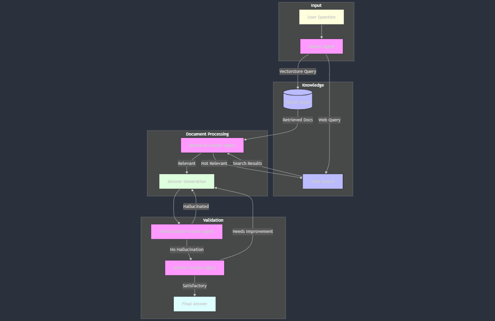

# How I Built Social Media Content Moderation Quality Control Using AI Agents

Hands-on : Building a Smart System for Rapid Marketing Strategy Generation and Selection, every detail spelled out

TL;DR

I built an AI-powered Marketing Campaign Analyzer that generates and evaluates marketing strategies. It uses multiple AI agents to create campaigns and a judge agent to pick the best one. The system has a user-friendly interface for inputting product details and viewing results. This project demonstrates how AI can be practically applied in marketing to save time and potentially improve campaign effectiveness.

## Introduction

Picture this: You’re a marketing manager swamped with campaign ideas, each promising to be the next big thing. How do you choose? What if AI could not only generate these ideas but also pick the best one? That’s exactly what I set out to build — a Marketing Campaign Analyzer powered by AI agents. Let me take you on this exciting journey of blending technology with creativity.

Full Article : [https://medium.com/@learn-simplified/How-I-Built-Social-Media-Content-Moderation-Quality-Control-Using-AI-Agents-75f66dc49a0c


## What's This Project About

This article is a deep dive into my process of creating an AI-driven marketing campaign analyzer. I’ll walk you through how I used multiple AI agents to generate and evaluate marketing strategies. You’ll see how I combined a user-friendly interface with complex AI processing, allowing users to input product details and receive AI-generated marketing strategies along with an AI judge’s decision on the best approach. It’s a practical look at how AI can be leveraged to streamline and enhance marketing decision-making processes.

## Why Work on It?

In today’s fast-paced business world, AI isn’t just a buzzword — it’s becoming a necessity. This article showcases how even a fictional company can implement AI to revolutionize its marketing approach. By reading this, you’ll gain insights into:

 - How AI can generate creative marketing strategies
 - The process of evaluating marketing ideas using AI
 - Practical implementation of AI in a business context
 - Building a user-friendly interface for complex AI systems

Whether you’re a marketing professional looking to stay ahead of the curve, a tech enthusiast curious about AI applications, or a business owner considering AI integration, this article offers valuable insights into the future of marketing and AI’s role in it.

## Architecture



# Tutorial: Lets Built Marketing Campaign Analyzer Using AI Agents

## Prerequisites
- Python installed on your system.
- A basic understanding of virtual environments and command-line tools.

## Steps

1. **Virtual Environment Setup:**
   - Create a dedicated virtual environment for our project:
   
     ```bash
     python -m venv How-I-Built-Social-Media-Content-Moderation-Quality-Control-Using-AI-Agents
     ```
   - Activate the environment:
   
     - Windows:
       ```bash
       How-I-Built-Social-Media-Content-Moderation-Quality-Control-Using-AI-Agents\Scripts\activate       
       ```
     - Unix/macOS:
       ```bash
       source How-I-Built-Social-Media-Content-Moderation-Quality-Control-Using-AI-Agents/bin/activate
       ```
   
# Installation and Setup Guide

**Install Project Dependencies:**

Follow these steps to set up and run the  Marketing Campaign Analyzer Using AI Agents

1. Navigate to your project directory:
   ```
   cd path/to/your/project
   ```
   This ensures you're in the correct location for the subsequent steps.

2. Install the required dependencies:
   ```
   pip install -r requirements.txt
   pip -q install git+https://github.com/openai/swarm.git
   ```
   This command installs all the necessary Python packages listed in the requirements.txt file.


## Run - Hands-On Guide: Built Marketing Campaign Analyzer Using AI Agents

   ```bash 
     
      # Run 
      streamlit run main.py
      
   ```

## Conclusion and Next Steps

Congratulations! You've just built Marketing Campaign Analyzer Using AI Agents
